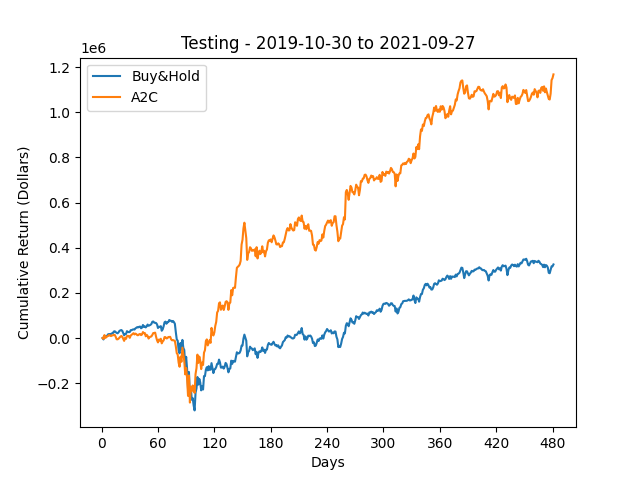
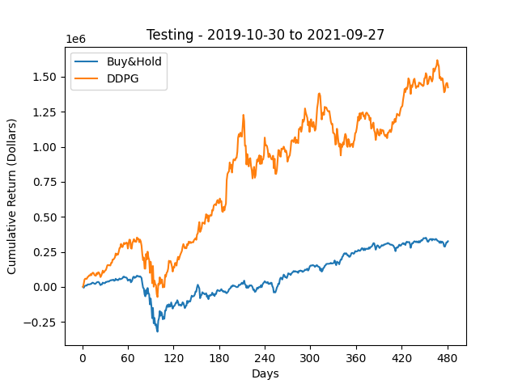

# Actor-Critic-Trader

This project uses Actor-Critic Deep Reinforcement Learning algorithms including A2C (Advantage Actor Critic), DDPG (Deep Deterministic Policy Gradient), and PPO (Proximal Policy Optimization) for portfolio management.

## Quickstart

1. Clone repo

   ```
   git clone https://github.com/Zhouxunzhe/Actor-Critic-Trader.git
   ```

2. Prepare conda env (assuming you have [conda](https://docs.conda.io/projects/conda/en/latest/user-guide/install/) installed)

   Alternatively, you can skip this step and directly install on your Python env

   ```
   # We require cuda-11.3 python<=3.9
   conda create -n actrader python=3.9
   conda activate actrader
   ```

3. pip install requirements

   ```
   cd Actor-Critic-Trader
   pip install --upgrade pip
   pip install -r requirements.txt
   ```

4. For cuda user (cuda 11.3)

   ```
   conda install pytorch==1.9.1 torchvision==0.10.1 torchaudio==0.9.1 cudatoolkit=11.3 -c pytorch -c conda-forge
   ```
   
5. Train the models

   ```
   python main.py
   ```

## Datasets

[Dow Jones Industrial Average (DJIA) 1990 - 2021](https://en.wikipedia.org/wiki/Dow_Jones_Industrial_Average)

## **Result**

**A2C (Actor-Critic)** reaches profits _ at _ round, against _ of buy&hold.



**DDPG (Deep Deterministic Policy Gradient)** reaches profits _ at _ round, against _ of buy&hold.



**PPO (Proximal Policy Optimization)** reaches profits _ at _ round, against _ of buy&hold.


## Conclusion

## Documentation

Browse the [project_report.pdf](./assets/project_report.pdf)

## License

Actor-Critic-Trader is MIT licensed. See the [LICENSE file](./LICENSE) for details.