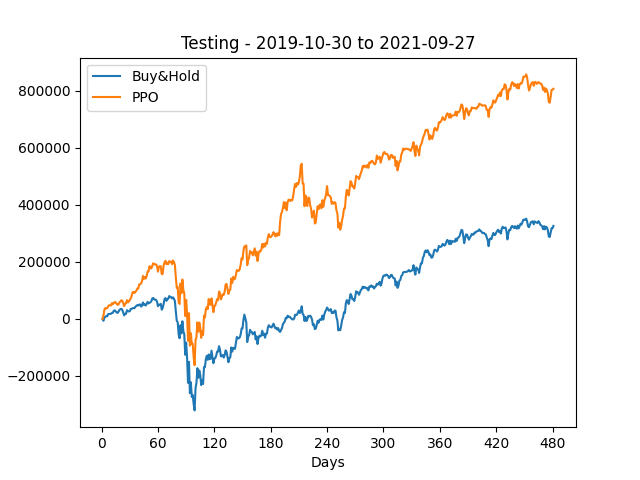

# Actor-Critic-Trader

This project uses Actor-Critic Deep Reinforcement Learning algorithms including A2C (Advantage Actor Critic), DDPG (Deep Deterministic Policy Gradient), and PPO (Proximal Policy Optimization) for portfolio management.

## Quickstart

1. Clone repo

   ```
   git clone https://github.com/Zhouxunzhe/Actor-Critic-Trader.git
   ```

2. Prepare conda env (assuming you have [conda](https://docs.conda.io/projects/conda/en/latest/user-guide/install/) installed)

   Alternatively, you can skip this step and directly install on your Python env

   ```
   # We require cuda-11.3 python<=3.9
   conda create -n actrader python=3.9
   conda activate actrader
   ```

3. pip install requirements

   ```
   cd Actor-Critic-Trader
   git clone https://github.com/vnpy/vnpy.git
   conda install -c conda-forge ta-lib
   pip install --upgrade pip
   pip install -r requirements.txt
   ```

4. For cuda user (cuda 11.3)

   ```
   pip install torch==1.9.1+cu111 torchvision==0.10.1+cu111 torchaudio==0.9.1 -f https://download.pytorch.org/whl/torch_stable.html
   ```
   
5. Train the models

   ```
   python main.py
   ```

## Datasets

[Dow Jones Industrial Average (DJIA) 1990 - 2021](https://en.wikipedia.org/wiki/Dow_Jones_Industrial_Average)

[SSE Composite Index(SH)  2019 - 2024](https://en.wikipedia.org/wiki/SSE_Composite_Index)

## **Result**

**A2C (Actor-Critic)** reaches the most profits at the 13 round.


**DDPG (Deep Deterministic Policy Gradient)** reaches the most profits at the 14 round.


**PPO (Proximal Policy Optimization)** reaches the most profits at the 33 round.



## Run on VeighNa 

1. run VeighNa GUI

   ```
   python run.py
   ```

2. I have modified site-packages in vnpy, you can copy the packages in folder `vnpy/site-packages` to your VeighNa dependency path.

3. Import Data into VeighNa Trader

   Import the downloaded data into the VeighNa Trader platform. Ensure that the column names match the expected format. You can do this manually or by editing the CSV file.

   

4. train your model

   ```
   python vnpy/train/[your_model_name].py
   ```

5. run backtest

   Click on CTA Backtesting in the main menu. Select the desired strategy (e.g. AC_Transformer_Strategy). Choose the local data corresponding to your imported data (e.g. AAPL.LOCAL). Set the start and end dates for the backtest.

   

#### **Existed problems**

- loss will not go down
- reward always 0: reward = targets - states[:, -1, 3] not work !!!! (reward not defined)
- argmax return the same output
- lstm return the same output
- action compute loss with advantage, no backward

#### **solution**

- change the input_dim: without volume for lstm, otherwise it will have weight explosion
- define the reward function for reinforcement learning

## Conclusion

For Actor-Critic Algorithms, I have implemented multiple stocks trading strategy using DDPG, A2C,PPO

For VNPY Actor-Critic Algorithms, I have implemented single stocks trading strategy using actor-critic, LSTM, CNN, Transformer.

## Documentation

Browse the [project_report.pdf](./assets/project_report.pdf)

## License

Actor-Critic-Trader is MIT licensed. See the [LICENSE file](./LICENSE) for details.