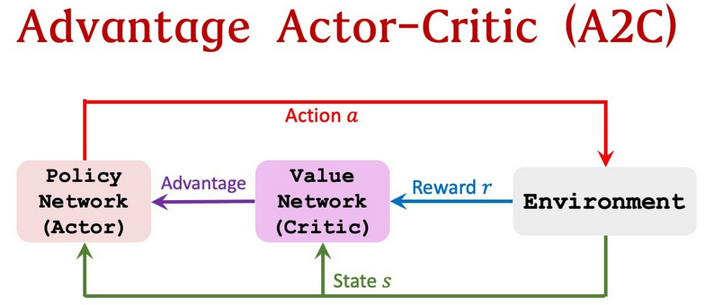
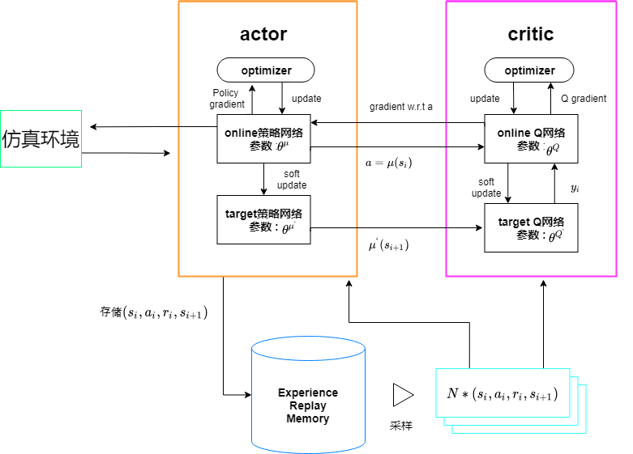
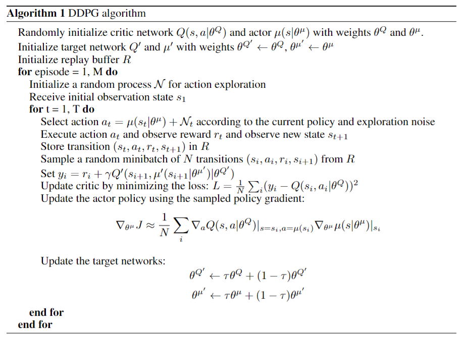
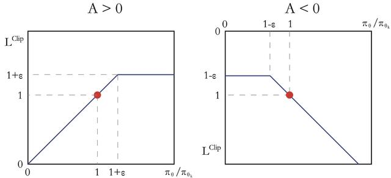
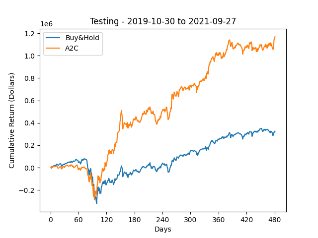
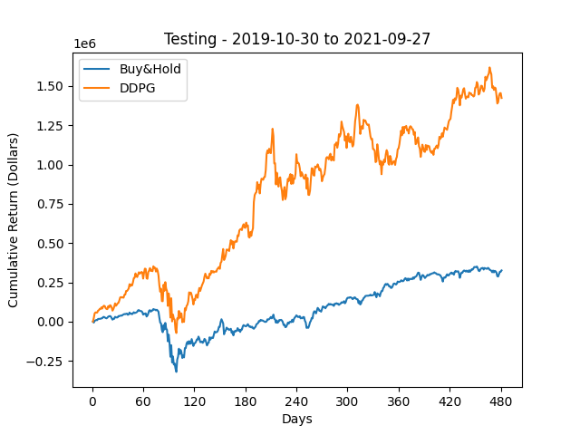
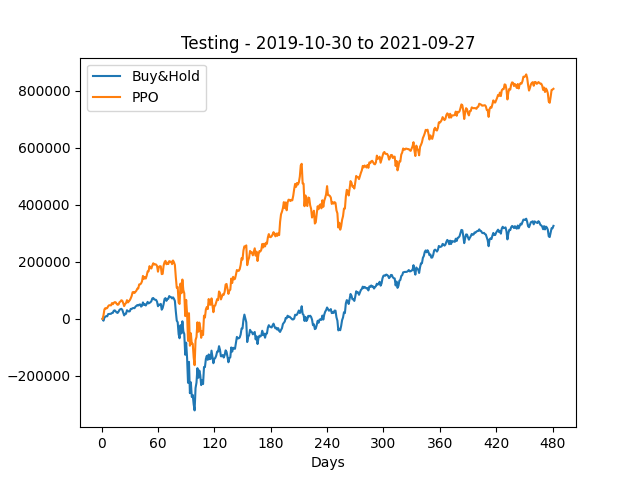

# Actor_Critic_Trader

在本项目中，使用了演员-评论深度强化学习算法，包括A2C（优势-演员-评论家）、DDPG（深度确定性策略梯度）和PPO（近端策略优化）来进行投资组合管理。

## Quickstart

1. 克隆GitHub仓库

   ```
   git clone https://github.com/Zhouxunzhe/Actor_Critic_Trader.git
   ```

2. 准备conda环境（假设已经安装了[conda](https://docs.conda.io/projects/conda/en/latest/user-guide/install/)）

   Note：或者也可以忽视这一步，直接在电脑python中安装运行环境

   ```
   # We require python<=3.8
   conda create -n actrader python=3.9
   conda activate actrader
   ```

3. 安装运行环境

   ```
   cd QuantProgramming
   pip install --upgrade pip
   pip install -r requirements.txt
   ```

4. 训练模型

   ```
   python main.py
   ```

## Introduction

#### **演员–评论家算法 AC（Actor-Critic）**

当代理在环境中执行操作和移动时，它将观察到的环境状态映射到两个可能的输出：

- 推荐动作：动作空间中每个动作的概率值。代理中负责此输出的部分称为actor（演员）。
- 未来预期回报：它预期在未来获得的所有回报的总和。负责此输出的代理部分是critic（评论家）。

演员和评论家学习执行他们的任务，这样演员推荐的动作就能获得最大的回报：

- 演员Actor：它将环境的状态作为输入，并为其动作空间中的每个动作返回一个概率值。
- 评论家Critic：它将的环境状态作为输入，并返回对未来总回报的估计。

Actor通过Critic给出的分数去学习：如果Critic给的分数高，那么Actor会调整这个动作的输出概率；相反，如果Critic给的分数低，那么就减少这个动作输出的概率。

Actor-Critic方法结合了值函数逼近（Critic）和策略函数逼近（Actor），它从与环境的交互中学习到越来越精确的Critic（评估），能够实现单步更新，相对单纯的策略梯度，Actor-Critic能够更充分的利用数据。

Actor价值函数梯度（梯度上升）：
$$
\nabla \bar{R}_{\theta} = \frac{1}{N} \sum_{n=1}^{N} \sum_{t=1}^{T_n} Q^{\pi_\theta}(s_t^n, a_t^n) \nabla \log p_{\theta}(a_t^n | s_t^n)
$$
Critic损失函数（梯度下降）：
$$
loss = \frac{1}{N} \sum_{n=1}^{N} \sum_{t=1}^{T_n} \left( r_t^n + \max_{a_{t+1}^n} Q^{\pi_\theta}(s_{t+1}^n, a_{t+1}^n) - Q^{\pi_\theta}(s_t^n, a_t^n) \right)^2
$$

#### 确定策略梯度 DPG (Deterministic Policy Gradient)

顾名思义，DPG是一种deterministic的policy gradient算法。policy gradient算法的基本思想是，用一个参数化的概率分布 $$\pi_{\theta}(a | s) = P[a | s; \theta]$$ 来表示policy，并且由于policy是一个概率分布，那么action $$a$$ 就是随机选取的，也就是所谓的Stochastic Policy Gradient。DPG做的事情，就是摒弃了用概率分布表示policy的方法，转而用一个确定性的函数 $$a=\mu_{\theta}(s)$$ 表示policy。也就是说，给定当前的state $$s$$ ，选取的action $$a$$ 就是确定的。

相对于stochastic function，用deterministic function表示policy有其优点和缺点。优点就是，从理论上可以证明，deterministic policy的梯度就是Q函数梯度的期望，这使得deterministic方法在计算上比stochastic方法更高效；但缺点也很明显，对于每个state，下一步的action是确定的。这就导致只能做exploitation而不能做exploration。这可能也是为什么policy gradient一开始就采用stochastic算法的原因。

为了解决不能做exploration的问题，DPG采用了off-policy的方法。也就是说，采样的policy和待优化的policy是不同的：其中采样的policy是stochastic的，而待优化的policy是deterministic的。采样policy的随机性保证了充分的exploration。

Policy Gradient的计算公式
$$
\nabla_{\theta^\mu} J \approx \mathbb{E}_{s_t \sim \rho^\beta} \left[ \nabla_{\theta^\mu} Q(s, a | \theta^Q) \bigg|_{s=s_t, a=\mu(s_t|\theta^\mu)} \right] \\
= \mathbb{E}_{s_t \sim \rho^\beta} \left[ \nabla_a Q(s, a | \theta^Q) \bigg|_{s=s_t, a=\mu(s_t)} \nabla_{\theta^\mu} \mu(s | \theta^\mu) \bigg|_{s=s_t} \right]
$$

- $$s$$ 和  $$a$$ 分别是 state 和 action；
- $$Q$$ 为 $$Q$$ 函数，即 action value 函数， $$\theta^Q$$ 为其参数；
- $$J$$ 表示的是初始状态分布下的期望回报，也就是给定初始状态的概率分布，期望能够获得的总 reward（可能要考虑折扣因子 $$\gamma$$），我们的目标就是使得 $$J$$ 越大越好；
- $$s_t$$ 表示在 $$t$$ 时刻的状态，而 $$\rho^{\beta}$$ 则表示在随机采样 policy $$\beta$$ 之下，每个 state 被访问的概率分布；
- $$\mu$$ 表示待优化的 deterministic policy， $$\theta^{\mu}$$ 是它的参数。

#### 深度Q网络 DQN (Deep Q-Network)

DQN在DPG后一年发表，主要是解决了用神经网络拟合Q函数（也就是action-value函数）导致的训练不稳定的问题。在DQN之前，用神经网络去拟合Q函数（也就是action-value函数）是不被看好的，因为在训练的时候会非常不稳定。导致训练不稳定的原因：

- 在 observation sequence 里的元素存在相关性，这会违背机器学习训练样本的 $$iid$$ 假设。例如，某次 observation sequence 为 $$S_0, A_0, R_0, S_1, A_1, R_1, \cdots, S_n, A_n, R_n$$，后面的 state, action 和 reward 都会强烈依赖于前面的 state, action 和 reward；
- $$Q$$ 函数的一点小改动可能会显著地改变 policy，从而改变 observation sequence 中的数据分布，这也会违背机器学习训练样本的 $$iid$$ 假设；
- 在 $$Q$$ 函数（待优化的对象）和 $$r + \gamma \max_{a'} Q(s', a')$$（优化的 target）之间也存在强相关，因为都是来自于同一个 $$Q$$ 函数。很难想象如果在一般机器学习任务中，data 和 label 都是从一个模型中生成的，模型到底会学到什么。

基于上面的分析，DQN 提出了几点改进：

- 采用了一个名为 experience replay 的操作，即把 observation sequence 的序列关系打乱，只储存 agent 的 experiences $$(s_t, a_t, r_t, s_{t+1})$$；
- 将待优化的 $$Q$$ 函数与作为 target 的 $$Q$$ 函数分开，待优化的 $$Q$$ 函数持续更新参数，每隔一段时间才将前者的参数赋值给后者。

为什么这两个改进能够解决上面的问题呢？

- experience replay 操作只存储四元组 $$(s_t, a_t, r_t, s_{t+1})$$，而四元组与四元组之间是没有相关性的，从而成功地将训练样本 $$(S_0, A_0, R_0, \cdots, S_n, A_n, R_n)$$ 之间的相关性转化为训练样本（四元组）之间的相关性；
- 将待优化的 $$Q$$ 函数和作为 target 的 $$Q$$ 函数分离，前者更新快而后者更新慢。这首先解决了第二个问题，虽然 policy 仍对前者的参数敏感，但是由于训练数据的 target 是由后者生成的，前者参数的变化不会对训练的 target 造成快速的变化；
- 此外，上述操作还解决了第三个问题。由于两个 $$Q$$ 函数分离了，所以 data（由待优化的 $$Q$$ 函数生成）和 target（由作为 target 的 $$Q$$ 函数生成）之间的相关性就消失了。

这样，DQN 非常漂亮地解决了神经网络用于 $$Q$$ 函数近似时的不稳定性问题。但是这个解决方案也不是没有缺陷的，由于作为 target 的 $$Q$$ 函数更新缓慢，所以训练的速度相应地也会减缓。但是作者表示训练的稳定性显然是远远超过训练速度的损失的。

## Methods

#### **优势-演员-评论家 Advantage-Actor-Critic（A2C）**

深度强化学习中，很多基础算法都是单线程的，也就是一个 agent 去跟环境交互产生经验。基础版 Actor-Critic ，由于环境是固定不变的，agent 的动作又是连续的，这样收集到的经验就有很强的时序关联，而且在有限的时间内也只能探索到部分状态和动作空间。为了打破经验之间的耦合，可以采用Experience Replay的方法，让 agent 能够在后续的训练中访问到以前的历史经验，而对于基于策略类的算法，agent 收集的经验都是以 episode为单位的，跑完一个episode 后经验就要丢掉，更好的方式是采用多线程的并行架构，这样既能解决前面的问题，又能高效利用计算资源，提升训练效率。

Advantage Actor-Critic（A2C） 算法引入了**并行架构**，各个 agent 都会独立的跟自己的环境去交互，得到独立的采样经验，而这些经验之间也是相互独立的，这样就打破了经验之间的耦合，起到跟 Experience Replay 相当的效果。因此通常 A2C和A3C 是不需要使用 Replay Buffer 的，因为结构本身就可以替代了。



什么是优势？ Q值实际上可以分解为两部分：状态值函数 $$V(s)$$ 和优势值 $$A(s,a)$$：
$$
Q(s,a)= V(s)+ A(s,a)
$$
优势函数能够评估在给定状态下与其他行为相比更好的行为，价值函数则是评估在此状态下行为的良好程度。与其让评论家学习Q值，不如让评论家学习Advantage值 。 这样，对行为的评估不仅基于行为的良好程度，而且还取决于行为可以改善的程度。 优势函数的优势是它减少了策略网络的数值差异并稳定了模型。

Actor价值函数梯度（梯度上升）：
$$
\nabla \bar{R}_{\theta} = \frac{1}{N} \sum_{n=1}^{N} \sum_{t=1}^{T_n} \left( Q^{\pi_\theta}(s_t^n, a_t^n) - V^{\pi_\theta}(s_t^n) \right) \nabla \log p_{\theta}(a_t^n | s_t^n)
$$
Critic损失函数（梯度下降）：
$$
loss = \frac{1}{N} \sum_{n=1}^{N} \sum_{t=1}^{T_n} \left( r_t^n + V^{\pi}(s_{t+1}^n) - V^{\pi}(s_t^n) \right)^2
$$

#### **深度确定策略梯度 DDPG (Deep Deterministic Policy Gradient)**

一种学习连续动作的无模型策略算法。它结合了DPG（确定性策略梯度）和DQN（深度Q网络）的思想，利用DQN中的经验重放和延迟更新的目标网络，并基于DPG，可以在连续的动作空间上运行。

和演员-评论家的方法一样，DDPG也有两个worker：

- 演员提出一个给定状态的动作。
- 评论家预测给定的状态和动作是好（正值）还是坏（负值）。



但是DDPG使用了另外2种技术： 

- 使用了两个目标网络（online / target network）增加训练的稳定性，从估计的目标和目标网络学习更新，从而保持它估计的目标稳定。
- 使用了经验回放，用于存储元组列表（状态、动作、奖励、下一个状态），不仅仅从最近的经验中学习，而是从取样中学习到迄今为止积累的所有经验。

网络更新算法：



#### 近端策略优化算法 PPO（Proximal Policy Optimization）

基于策略的方法如策略梯度算法和 Actor-Critic 算法虽然简单、直观，但是这种算法有一个明显的缺点：当策略网络是深度模型时，沿着策略梯度更新参数，很有可能由于步长太长，策略突然显著变差，进而影响训练效果，在实际应用过程中会遇到训练不稳定的情况。

我们考虑在更新时找到一块信任区域（trust region），在这个区域上更新策略时能够得到某种策略性能的安全性保证，这就是信任区域策略优化（trust region policy optimization，TRPO）算法的主要思想。TRPO 算法在 2015 年被提出，它在理论上能够保证策略学习的性能单调性，并在实际应用中取得了比策略梯度算法更好的效果。（TRPO公式和推导过于复杂，详情参考[原文](https://arxiv.org/abs/1502.05477)）

然而TRPO的计算过程非常复杂，每一步更新的运算量非常大。于是，TRPO 算法的改进版——PPO 算法在 2017 年被提出，PPO 基于 TRPO 的思想，但是其算法实现更加简单。并且大量的实验结果表明，与 TRPO 相比，PPO 能学习得一样好（甚至更快），这使得 PPO 成为非常流行的强化学习算法。如果我们想要尝试在一个新的环境中使用强化学习算法，那么 PPO 就属于可以首先尝试的算法。

TRPO 使用泰勒展开近似、共轭梯度、线性搜索等方法直接求解。PPO 的优化目标与 TRPO 相同，但 PPO 用了一些相对简单的方法来求解。具体来说，PPO 有两种形式，一是 PPO-惩罚，二是 PPO-截断：

- **PPO-惩罚**（PPO-Penalty）用拉格朗日乘数法直接将 KL 散度的限制放进了目标函数中，这就变成了一个无约束的优化问题，在迭代的过程中不断更新 KL 散度前的系数。即：
  $$
  \arg \max_{\theta} \mathbb{E}_{s \sim \nu^{\pi_{\theta_k}}} \mathbb{E}_{a \sim \pi_{\theta_k}(\cdot|s)} \left[ \frac{\pi_{\theta}(a|s)}{\pi_{\theta_k}(a|s)} A^{\pi_{\theta_k}}(s, a) - \beta D_{KL}[\pi_{\theta_k}(\cdot|s), \pi_{\theta}(\cdot|s)] \right]
  $$
  令 $$d_k = D_{KL}^{\nu^{\pi_{\theta_k}}}(\pi_{\theta_k}, \pi_{\theta})$$，$$\beta$$ 的更新规则如下：

  1. 如果 $$d_k < \delta / 1.5$$，那么 $$\beta_{k+1} = \beta_k / 2$$
  2. 如果 $$d_k > \delta \times 1.5$$，那么 $$\beta_{k+1} = \beta_k \times 2$$
  3. 否则 $$\beta_{k+1} = \beta_k$$

  其中，$$\delta$$ 是事先设定的一个超参数，用于限制学习策略和之前一轮策略的差距。

- **PPO-截断**（PPO-Clip）更加直接，它在目标函数中进行限制，以保证新的参数和旧的参数的差距不会太大。即：
  $$
  \arg \max_{\theta} \mathbb{E}_{s \sim \nu^{\pi_{\theta_k}}} \mathbb{E}_{a \sim \pi_{\theta_k}(\cdot|s)} \left[ \min \left( \frac{\pi_{\theta}(a|s)}{\pi_{\theta_k}(a|s)} A^{\pi_{\theta_k}}(s, a), \text{clip} \left( \frac{\pi_{\theta}(a|s)}{\pi_{\theta_k}(a|s)}, 1 - \epsilon, 1 + \epsilon \right) A^{\pi_{\theta_k}}(s, a) \right) \right]
  $$

  其中 $$\text{clip}(x, l, r) := \max(\min(x, r), l)$$，即把 $$x$$ 限制在 $$[l, r]$$ 内。上述 $$\epsilon$$ 是一个超参数，表示进行截断（clip）的范围。

  如果 $$A^{\pi_{\theta_k}}(s, a) > 0$$，说明这个动作的价值高于平均，最大化这个式子会增加 $$\frac{\pi_{\theta}(a|s)}{\pi_{\theta_k}(a|s)}$$，但不会让其超过 $$1 + \epsilon$$。反之，如果 $$A^{\pi_{\theta_k}}(s, a) < 0$$，最大化这个式子会减小 $$\frac{\pi_{\theta}(a|s)}{\pi_{\theta_k}(a|s)}$$，但不会让其超过 $$1 - \epsilon$$。如图所示。

  

## Experiments

#### **Dataset**

#### **Result**

**演员–评论家算法 AC（Actor-Critic）**

A2C 在训练的第 TODO 轮实现了 TODO 的收益，超过了buy&hold (baseline) TODO 的收益：



**DDPG (Deep Deterministic Policy Gradient)**

DDPG 在训练的第 TODO 轮实现了 TODO 的收益，超过了buy&hold (baseline) TODO 的收益：



**PPO (Proximal Policy Optimization)**

PPO 在训练的第 TODO 轮实现了 TODO 的收益，超过了buy&hold (baseline) TODO 的收益：



## Conclusion

## Reference

https://github.com/matinaghaei/Portfolio-Management-ActorCriticRL

https://www.paddlepaddle.org.cn/documentation/docs/zh/practices/reinforcement_learning/actor_critic_method.html#actor-critic-method

https://www.paddlepaddle.org.cn/documentation/docs/zh/practices/reinforcement_learning/advantage_actor_critic.html

https://zhuanlan.zhihu.com/p/337976595

https://hrl.boyuai.com/chapter/2/trpo%E7%AE%97%E6%B3%95/

https://hrl.boyuai.com/chapter/2/ppo%E7%AE%97%E6%B3%95/

https://arxiv.org/pdf/1509.02971

https://arxiv.org/abs/1502.05477

## License

Actor-Critic-Trader is MIT licensed. See the [LICENSE file](../LICENSE) for details.